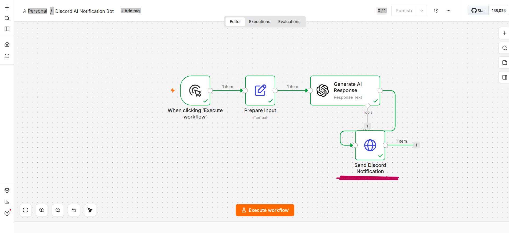
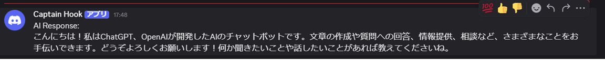

# AI Discord Notification Workflow

## Overview
AI-powered notification automation workflow built with n8n, OpenAI API, and Discord Webhook.

The workflow automatically generates AI responses and sends real-time notifications to Discord channels.

## Technologies Used
- n8n
- Docker
- OpenAI API
- Discord Webhook
- JSON
- HTTP Request

## Workflow Structure

When clicking 'Execute Workflow'
↓
Prepare Input
↓
Generate AI Response
↓
Send Discord Notification

## Features
- OpenAI API integration
- Discord Webhook integration
- AI-generated message automation
- Workflow automation using n8n
- Docker-based local environment

## Screenshots

### Workflow Overview

### Discord Notification Result

## Future Improvements
- Scheduled automation
- Gmail integration
- Notion integration
- Error handling
- AI news summarization
